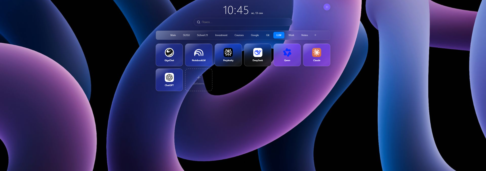

# Pretty-Menu ※ Google homepage extension

Надоела пустая домашняя страница Chrome или не хватает плиток для всех заметок? Не хватает группировки? Мне тоже. Поэтому вместо неё - своя панель с плитками, группами и поиском. Всё работает локально, ничего не утекает в сеть, а если и утекает - то только в Google, куда вы сами попросили.

Родилось это из простой мысли: «почему я не могу сохранить 100500 закладок на домашней странице и группировать их?». Теперь мое сердце ОКРщика спокойно.

---

## Что умеет

- **Плитки** - большие, с иконками (дефолтные сайта или свои). Можно быстро сохранять сайты на домашнюю страницу, не сохраняя ссылку, не вводя название сайта - просто правая клавиша мыши.
- **Группы** - вкладки-папки: «Работа», «Учёба», «Развлечения». Можно переименовать, перекрасить, удалить, перетащить порядок.
- **Поиск** - строка с Google Suggest.
- **Поиск по картинке** - кнопка-камера: загрузить файл (откроются Google Картинки) или вставить ссылку на изображение.
- **Часы** - 5 стилей + 2 цвета на выбор.
- **Темы** - светлая, тёмная, стеклянная + своя фоновая картинка из файла.
- **Цвета** - акцентный цвет интерфейса и индивидуальные цвета групп.
- **Бэкап** - все плитки, группы и настройки сохраняются в JSON-файл и восстанавливаются из него.

---

## Как установить

1. Скачай/распакуй папку `src` в надежное место.
2. Открой `chrome://extensions/`.
3. Включи **«Режим разработчика»**.
4. Нажми **«Загрузить распакованное расширение»** и выбери папку `src`.
5. Открой новую вкладку - вуаля.

Обновление после изменений кода: на странице расширений жми ⟳. Иногда после обновлений разрешения приходится удалить расширение и загрузить заново.

---

## Структура

- **manifest.json** - говорит Chrome, что это расширение, какие права нужны, и подменяет новую вкладку (`chrome_url_overrides`).
- **index.html + style.css** - сама страница панели и её внешний вид.
- **app.js** - вся логика: плитки, группы, темы, поиск, сохранение. Работает на `localStorage` - данные не теряются при перезапуске браузера.
- **background.js** - фоновый сервис: контекстное меню «Добавить сайт в плитки» (правый клик на любом сайте → выбрать группу) и открытие ссылок Google.

---

## Известные ограничения

- **Загрузка файла в поиске по картинке** - открывает Google Картинки, где файл выбираешь сам. Автоматическая загрузка через расширение упирается в защиту Chrome ("window.open blocked due to active file chooser").

---

## В планах

- Перетаскивание плиток между группами мышкой (пока это через правый клик).
- Импорт из системных закладок Chrome.
- Тёмная тема, которая сама переключается по времени суток.

Нашли баг или придумали фичу - кидайте идею, код открыт.

> **Disclaimer:** это локальное расширение, которое вы ставите себе сами. Все данные - в вашем компьютере.